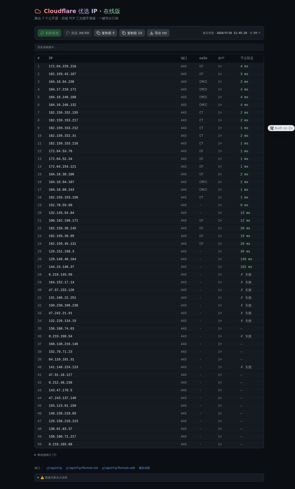

# cf-best-ip · 你自己的 Cloudflare 优选 IP 服务

[](LICENSE)
[](https://workers.cloudflare.com/)
[](https://zo.computer/)

一个开箱即用、可托管到「域名平台」的 Cloudflare 优选 IP 一站式服务。融合了社区主流方案的优点（详见 [`docs/analysis.md`](docs/analysis.md)）：

| 特性 | 说明 |
|---|---|
| 🧲 **多源聚合** | 自动从 7 个公开数据源抓候选 IP，单源失败会自动跳过 |
| 🛰️ **TCP 三次握手测速** | Cloudflare 版用 `cf.resolveOverride`，zo.space 版用 Node `net` |
| ⚡ **网页一键测速** | 浏览器调用后端 probe 接口，结果按延迟自动排序 |
| 🌐 **多协议接口** | `/sub`（纯文本订阅） · `/api/ips`（JSON） · `/api/preferred-ips`（兼容 EdgeTunnel） |
| 📡 **DNS 自动同步** | Cloudflare 版可选；用 CF API Token 批量替换 A 记录 |
| ⏰ **定时刷新** | Cron Trigger 每 6 小时自动刷新（CF 版） |
| 🔒 **管理员 + 订阅 token** | 防白嫖 |
| 🚀 **零服务器** | 全部跑在边缘 / 你的域名平台 |

> 在线 demo（基于 zo.space）：<https://truepuma.zo.space/cf-ip>



## 📦 仓库结构

```text
cf-best-ip/
├── src/worker.js          # 主产物：Cloudflare Worker 单文件（可独立部署）
├── wrangler.toml          # Cloudflare 部署配置
├── zo-space/              # zo.space（Hono + React）部署版本
│   ├── pages/cf-ip.tsx    # 在线测速主页
│   └── api/
│       ├── cf-ip.get.ts        # GET /api/cf-ip
│       ├── cf-ip.refresh.ts    # POST /api/cf-ip/refresh
│       └── cf-ip.probe.ts      # GET /api/cf-ip/probe?ip=...
├── data/ips.json          # 数据落盘（zo.space 版用）
├── docs/analysis.md       # 主流方案对比
└── README.md
```

## 🚀 部署方式 A：Cloudflare Workers（推荐）

> 完全免费，自带全球 CDN，无需服务器。

1. **登录 Cloudflare 并安装 wrangler**

   ```bash
   npm i -g wrangler
   wrangler login
   ```

2. **创建 KV 命名空间**

   ```bash
   wrangler kv namespace create KV
   ```

   把返回的 `id` 填进 `wrangler.toml`：

   ```toml
   [[kv_namespaces]]
   binding = "KV"
   id = "刚才返回的 id"
   ```

3. **设置敏感变量**

   ```bash
   wrangler secret put ADMIN_PASSWORD       # 必填，管理面板登录
   wrangler secret put SUB_TOKEN            # 可选，订阅地址鉴权
   wrangler secret put CF_API_TOKEN         # 可选，用于自动同步 DNS（需 Zone:DNS:Edit）
   ```

   若要自动同步 DNS，再在 `wrangler.toml` 里填上你的 Zone ID 和 A 记录名。

4. **部署**

   ```bash
   wrangler deploy
   ```

5. 打开 `https://cf-best-ip.<你的子域>.workers.dev`，登录 `/admin` 点「立即刷新」。

## 🚀 部署方式 B：zo.space / 任意支持 Hono 的边缘平台

`zo-space/` 目录是 Hono 风格的路由代码，直接复制对应文件到你的 zo.space 路由即可。
路由路径：

| 文件 | 路径 |
|---|---|
| `pages/cf-ip.tsx` | `/cf-ip` |
| `api/cf-ip.get.ts` | `GET /api/cf-ip` |
| `api/cf-ip.refresh.ts` | `POST /api/cf-ip/refresh` |
| `api/cf-ip.probe.ts` | `GET /api/cf-ip/probe` |

数据落盘到 `/home/workspace/Projects/cf-best-ip/data/ips.json`（路径在文件顶部可改）。

## 🔌 接口一览

| 接口 | 用途 |
|---|---|
| `GET /` | 网页（含一键测速） |
| `GET /sub` | 纯文本订阅，`?token=xxx&limit=10&port=443` |
| `GET /api/ips` | JSON：包含 ip / port / colo / delay |
| `GET /api/preferred-ips` | EdgeTunnel/CFnew 兼容格式 |
| `GET /api/sources` | 列出当前数据源 |
| `POST /admin/refresh` | 立即重新聚合 + 测速（需登录） |
| `POST /admin/sync-dns` | 仅同步 DNS（需登录） |
| `POST /admin/save-config` | 修改配置 |
| `GET /cdn-cgi/trace` | 给浏览器测速用的 colo 信息 |

## 🧠 设计要点

1. **多源去重**：候选 IP 用 `ip:port` 作 key 合并，记录多个来源 → 命中次数越多越靠前。
2. **过滤内网 / 保留段**：解析时跳过 `10/8`、`127/8`、`192.168/16`、`172.16/12`、`169.254/16` 等。
3. **TCP 三次握手测速**：比 ICMP ping 更靠谱，正好对应 HTTPS 握手前的连接耗时。
4. **国家黑名单**：默认排除 `CN`（防止"自相残杀"路由），可在 `/admin` 修改。
5. **Cron Trigger**：每 6 小时刷新一次，刷新成功才覆盖旧值，失败保留旧数据。
6. **DNS 同步用 batch 接口**：原子提交 `deletes + posts`，不会出现"刚删完旧的、新的没写上"的窗口期。

## 📚 致谢 / 参考

本项目融合了下列开源项目的优点，特此鸣谢：

- [XIU2/CloudflareSpeedTest](https://github.com/XIU2/CloudflareSpeedTest)
- [xinyitang3/cfnb](https://github.com/xinyitang3/cfnb)
- [cmliu/edgetunnel](https://github.com/cmliu/edgetunnel)
- [ymyuuu/IPDB](https://github.com/ymyuuu/IPDB)
- 公开数据源：`addressesapi.090227.xyz`、`ip.164746.xyz`、`stock.hostmonit.com`

## 📄 License

MIT — see [LICENSE](LICENSE).
