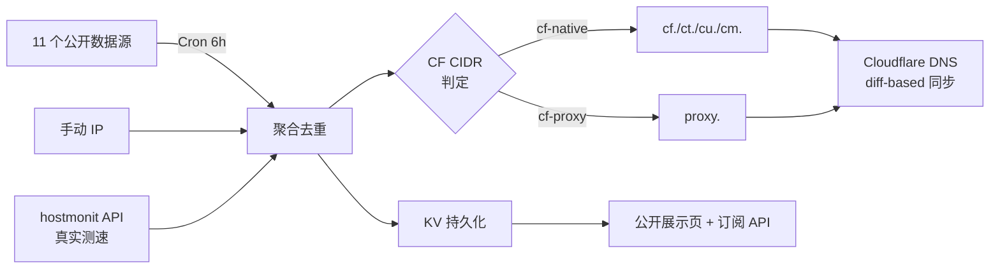

# cf-best-ip · Cloudflare 优选 IP 集大成版

[](LICENSE)
[](https://workers.cloudflare.com/)
[]()

> 融合 [cfnb](https://github.com/xinyitang3/cfnb)、[IPDB](https://github.com/ymyuuu/IPDB)、[hostmonit](https://api.hostmonit.com)、[CloudflareSpeedTest](https://github.com/XIU2/CloudflareSpeedTest) 等社区主流方案优点的 Cloudflare 优选 IP 一站式服务
>
> 🚀 11 个数据源聚合 · 真实测速数据 · 三网分流 · Cloudflare Workers 托管 · DNS 自动同步

## ✨ 在线 Demo

**https://cfip.leilaomi.cc.cd**(用 uouin.com / ipdb.030101.xyz 同款风格)


## 🎯 功能

### 公开页面(任何人可访问)
- ☁️ 5 个 tab 分类:**电信 / 联通 / 移动 / 通用 CF / 反代 IP**
- 📊 表格展示:线路徽章 · IP · 国家旗 · **延迟 · 丢包 · 速度(MB/s)**(数据来自 hostmonit 真实测速)
- 📋 一键复制 IP / 复制子域名
- ⏰ 实时倒计时显示下次 Cron 自动刷新
- 📱 移动端响应式(适配 6 寸屏)

### 后台
- 🔄 **11 个数据源**聚合,Cron 每 6 小时自动刷新
  - hostmonit/三网实测(uouin/ipdb 同源,带真实 latency/loss/speed)
  - IPDB GitHub 镜像(bestcf / bestproxy / proxy)
  - countrymerge / zip.cm.edu.kg(海量混合源)
  - addressesapi (CloudFlareYes / cmcc / ct / 164746.xyz)
  - uouin.com HTML 抓取
- 🎯 **精确分类**:用 Cloudflare 官方 15 个 IPv4 CIDR 段作 O(1) 位运算判定,准确区分 CF 自家 IP vs 反代 IP
- 🌐 **DNS 自动同步**:`cf./ct./cu./cm./proxy.your-domain.com` 5 个子域,diff-based 同步规避 Worker 子请求超限
- 📦 KV 持久化 + 30 天历史快照
- 🔔 Telegram / Discord / WxPusher 通知
- 🔐 `/admin` 管理面板(密码保护)
- 📡 订阅链路:`/sub`(纯文本)/ `/sub/edt`(EdgeTunnel)/ `/sub/vless`(V2RayN base64)/ `/sub/clash`(Clash YAML)
- 🇨🇳 智能就近推荐:按访问者 colo 距离推荐 IP(`?smart=1`)
- 🛡️ 可选 IP 可用性二次检测(`api.090227.xyz/check`)+ IP 风险等级过滤(`ipapi.is`)

## 🚀 快速部署

### 方式一:Cloudflare Workers Builds(推荐 GitHub 自动部署)

1. Fork 本仓库
2. 在 Cloudflare Dashboard → Workers & Pages → **Connect to Git**,选择你 fork 的仓库,部署
3. 在 Worker → Settings → Variables and Secrets 添加:

| 名称 | 类型 | 说明 |
|------|------|------|
| `ADMIN_PASSWORD` | Secret | 管理面板登录密码(必填) |
| `KV` | KV Namespace | 绑定一个 KV Namespace(必填) |
| `CF_API_TOKEN` | Secret | Zone:DNS:Edit 的 API Token(可选,启用 DNS 同步) |
| `CF_ZONE_ID` | Plaintext | 目标域名 Zone ID |
| `CF_RECORD_NAME` | Plaintext | 主 A 记录名,如 `cf.example.com` |
| `CF_DNS_BY_CARRIER` | Plaintext | `1` 启用按运营商分子域同步 |
| `DNS_TOP_N` | Plaintext | DNS 每子域同步前 N 个 IP(默认 10) |
| `SUB_TOKEN` | Secret | 订阅鉴权 token(可选,不设则公开) |
| `TELEGRAM_BOT_TOKEN` / `TELEGRAM_CHAT_ID` | Secret | TG 通知(可选) |
| `DISCORD_WEBHOOK` | Secret | Discord 通知(可选) |
| `WXPUSHER_TOKEN` / `WXPUSHER_UIDS` | Secret | 微信 WxPusher 通知(可选) |

4. 添加 Cron 触发器:`0 */6 * * *`(每 6 小时)

### 方式二:wrangler 命令行

```bash
git clone https://github.com/LeilaoMi/cf-best-ip.git
cd cf-best-ip
npm install -g wrangler
wrangler login

# 创建 KV
wrangler kv:namespace create cf_best_ip
# 把返回的 id 填到 wrangler.toml

# 配置 secrets
wrangler secret put ADMIN_PASSWORD
wrangler secret put CF_API_TOKEN
# ... 其他

wrangler deploy
```

## 🏗 架构



## 📊 数据来源对比

| 源 | 类型 | 是否带测速 | 三网分类 | 数量级 |
|---|---|---|---|---|
| **hostmonit/三网实测** | JSON POST | ✅ delay/loss/speed | ✅ CT/CU/CM | ~15 |
| IPDB/bestcf (github) | text | ❌ | ❌ | ~15 |
| IPDB/bestproxy (github) | text+country | ❌ | ❌ | ~100 |
| IPDB/proxy (github) | text | ❌ | ❌ | ~370 |
| countrymerge/all | text+country | ❌ | ❌ | ~20K |
| zip.cm.edu.kg/all | text+colo | ❌ | ❌ | ~17K |
| uouin.com/cloudflare | HTML | ❌ | ✅ | ~40 |
| addressesapi/* | text | ❌ | ✅ | ~10-15 |

## 🔑 关键 API

| 路径 | 说明 |
|---|---|
| `/` | 公开优选 IP 展示页 |
| `/api/ips` | JSON 列表(支持 carrier/country/perCountry 等过滤参数) |
| `/api/stats` | 池子统计 |
| `/api/refresh` | 手动触发刷新(60 秒冷却) |
| `/api/probe?ip=...&port=443` | 单 IP TCP 测速(注:Workers 禁止连 CF 自家 IP) |
| `/api/dns/current` | 看当前 DNS 同步状态 |
| `/sub` | 纯文本订阅(支持 carrier/country/top/smart) |
| `/sub/edt` | EdgeTunnel 兼容订阅 |
| `/sub/vless?uuid=xxx` | V2RayN base64 订阅 |
| `/sub/clash` | Clash YAML 订阅 |
| `/admin` | 管理面板(需要 `ADMIN_PASSWORD`) |

### 订阅参数

| 参数 | 说明 |
|---|---|
| `carrier=CT\|CU\|CM\|CF` | 按运营商过滤 |
| `country=US\|HK\|JP\|...` | 按国家过滤 |
| `top=30` | 返回前 N 个 |
| `smart=1` | 智能就近(按访问者 colo 距离) |
| `perCountry=1&perCountryN=2` | 分国家 top-N 模式(每国保留 N 个) |

## 📜 版本历史

- **v2.4**(2026-05-19)接入 hostmonit 真实测速源,公开页面加 uouin/ipdb 风格的表格,移动端响应式
- **v2.3**(2026-05-19)用 CF 官方 CIDR 表精确分类 native vs proxy
- **v2.2**(2026-05-19)IPDB 改用 GitHub raw 镜像绕开 CF 出站黑名单 + 分国家 top-N 模式
- **v2.1**(2026-05-19)cfnb 融合 - 可用性二检 + 风险过滤 + 自适应解析器
- **v2.0**(2026-05-18)首版集大成,11 路由 + 5 订阅格式 + 管理面板

## 🙏 致谢

本项目融合社区多个优秀方案:

- [xinyitang3/cfnb](https://github.com/xinyitang3/cfnb) - 三网分类 / 测速思路 / 国家过滤
- [ymyuuu/IPDB](https://github.com/ymyuuu/IPDB) - bestcf / bestproxy 数据源
- [xinyitang3/cfnb](https://github.com/xinyitang3/cfnb) 配置和过滤参数
- [api.uouin.com](https://api.uouin.com/cloudflare.html) - UI 设计参考
- [ipdb.030101.xyz](https://ipdb.030101.xyz/bestcfv4/) - UI 设计参考
- [api.hostmonit.com](https://stock.hostmonit.com/) - 真实三网测速数据
- [XIU2/CloudflareSpeedTest](https://github.com/XIU2/CloudflareSpeedTest) - 思路
- [cmliu/CF-Workers-SUB](https://github.com/cmliu) - 订阅格式参考

## 📄 License

MIT
