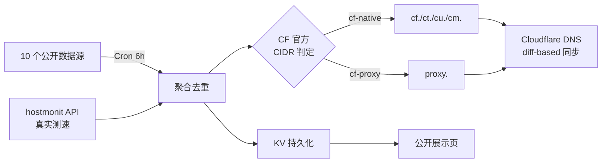

# cf-best-ip · Cloudflare 优选 IP 集大成版

[](LICENSE)
[](https://workers.cloudflare.com/)
[]()

> 融合 [cfnb](https://github.com/xinyitang3/cfnb)、[IPDB](https://github.com/ymyuuu/IPDB)、[hostmonit](https://api.hostmonit.com)、[CloudflareSpeedTest](https://github.com/XIU2/CloudflareSpeedTest) 等社区主流方案的 Cloudflare 优选 IP 一站式服务
>
> 🚀 10 个数据源聚合 · 真实测速数据 · 三网分流 · Cloudflare Workers 托管 · DNS 自动同步

## ✨ 在线 Demo

**https://cfip.leilaomi.cc.cd**(参考 [uouin.com](https://api.uouin.com/cloudflare.html) / [ipdb.030101.xyz](https://ipdb.030101.xyz/bestcfv4/) 风格)

## 🎯 功能

### 公开展示页(`/`)
- ☁️ 5 个分类 tab:**电信 / 联通 / 移动 / 通用 CF / 反代 IP**
- 📊 表格列:线路徽章 · IP · 丢包率 · 延迟 · 速度(MB/s)· 复制按钮
- 📋 一键复制 IP / 一键复制三网子域名(`cf./ct./cu./cm./proxy.your-domain`)
- ⏰ 实时倒计时显示距离下次 Cron 自动刷新
- 🔄 手动"立即刷新"按钮(60 秒冷却)
- 📱 移动端响应式(适配 6 寸屏,全部列可见)

### 后台机制
- **10 个数据源**聚合,Cron 每 6 小时自动刷新:
  | 源 | 是否带测速 | 三网分类 | 数量级 |
  |---|---|---|---|
  | **hostmonit/三网实测**(uouin/ipdb 同源) | ✅ delay/loss/speed | ✅ CT/CU/CM | ~15 |
  | addressesapi/CloudFlareYes | ❌ | ❌ | ~15 |
  | addressesapi/ip.164746.xyz | ❌ | ❌ | ~10 |
  | addressesapi/cmcc | ❌ | ✅ CM | ~6 |
  | addressesapi/ct | ❌ | ✅ CT | ~6 |
  | ip.164746.xyz/ipTop | ❌ | ❌ | ~2 |
  | IPDB/proxy(github raw)| ❌ | ❌ | ~370 |
  | IPDB/bestcf(github raw)| ❌ | ❌ | ~15 |
  | IPDB/bestproxy(github raw)| ❌ | ❌ | ~100 |
  | countrymerge/all | ❌ | ❌ | ~20K |
  | zip.cm.edu.kg/all(带 colo)| ❌ | ❌ | ~17K |
- **精确分类**:用 Cloudflare 官方 15 个 IPv4 CIDR 段做 O(1) 位运算,准确区分 CF 自家 IP vs 反代 IP
- **DNS 自动同步**:`cf./ct./cu./cm./proxy.<your-domain>` 5 个子域,diff-based 同步,规避 Worker 子请求超限
- **KV 持久化** + 30 天历史快照(每天一份)
- **Telegram 通知**(可选,见环境变量)

## 🚀 部署

### Cloudflare Workers Builds(推荐)

1. Fork 本仓库
2. Cloudflare Dashboard → Workers & Pages → **Connect to Git**,选择你 fork 的仓库,Deploy
3. Worker → Settings → Variables and Secrets 添加:

| 名称 | 类型 | 必填 | 说明 |
|------|------|------|------|
| `KV` | KV Namespace 绑定 | ✅ | 创建一个 KV namespace 并绑定,变量名 `KV` |
| `CF_API_TOKEN` | Secret | ⭕ | 想用 DNS 自动同步则需要(Zone:DNS:Edit 权限) |
| `CF_ZONE_ID` | Plaintext | ⭕ | 目标域名的 Zone ID |
| `CF_RECORD_NAME` | Plaintext | ⭕ | 主 A 记录名,如 `cf.example.com` |
| `CF_DNS_BY_CARRIER` | Plaintext | ⭕ | `1` 启用按运营商分子域(ct./cu./cm./proxy.) |
| `DNS_TOP_N` | Plaintext | ⭕ | DNS 每子域同步前 N 个 IP(默认 10) |
| `TELEGRAM_BOT_TOKEN` | Secret | ⭕ | TG 通知 bot token |
| `TELEGRAM_CHAT_ID` | Secret | ⭕ | TG 通知接收 chat id |

4. 添加 Cron 触发器:`0 */6 * * *`(每 6 小时)

### wrangler 命令行

```bash
git clone https://github.com/LeilaoMi/cf-best-ip.git
cd cf-best-ip
wrangler login
wrangler kv:namespace create cf_best_ip   # 把返回的 id 填到 wrangler.toml
wrangler secret put CF_API_TOKEN          # 按需添加其他 secrets
wrangler deploy
```

## 🏗 架构



## 🔑 主要 API

| 路径 | 说明 |
|---|---|
| `/` | 公开优选 IP 展示页 |
| `/api/ips` | JSON 列表(支持 `?carrier=CT&top=10` 等过滤参数) |
| `/api/stats` | 池子统计(总数 / CF 自家 / 反代 / 各源状态) |
| `/api/refresh` | 手动触发刷新(POST,60 秒冷却) |
| `/api/dns/current` | 查看当前 DNS 同步状态 |

### `/api/ips` 过滤参数

| 参数 | 说明 |
|---|---|
| `carrier=CT\|CU\|CM\|CF` | 按运营商过滤 |
| `top=30` | 返回前 N 个 |

## 🌐 关于 IP 国家

公开页面**不显示 IP 的国家**,因为 Cloudflare 是 anycast 网络 —— 同一个 IP 在全球数据中心同时被广播,不同的 GeoIP 服务商对它的归属经常给出不一致的答案(`IP2Location` 可能说在美国旧金山,`DB-IP` 可能说在加拿大多伦多)。延迟和速度是与你实际网络环境相关的、可测量的、唯一可信的指标。

## 📜 版本历史

- **v2.5**(2026-05-19)移动端全部列可见 · 移除误导性的 IP 国家列 · 移除 WxPusher · README 与实际代码/网站严格对齐
- **v2.4**(2026-05-19)接入 hostmonit 真实测速源,公开页面改为 uouin/ipdb 风格表格
- **v2.3**(2026-05-19)用 CF 官方 CIDR 表精确分类 native vs proxy
- **v2.2**(2026-05-19)IPDB 改用 GitHub raw 镜像 + 分国家 top-N 模式
- **v2.1**(2026-05-19)cfnb 融合 - 可用性二检 + 风险过滤 + 自适应解析器
- **v2.0**(2026-05-18)首版集大成,多源聚合 + DNS 同步

## 🙏 致谢

- [xinyitang3/cfnb](https://github.com/xinyitang3/cfnb) - 三网分类 / 国家过滤思路
- [ymyuuu/IPDB](https://github.com/ymyuuu/IPDB) - bestcf / bestproxy 数据源
- [api.uouin.com](https://api.uouin.com/cloudflare.html) - 公开展示页 UI 参考
- [ipdb.030101.xyz](https://ipdb.030101.xyz/bestcfv4/) - 公开展示页 UI 参考
- [api.hostmonit.com](https://stock.hostmonit.com/) - 真实三网测速数据 API
- [XIU2/CloudflareSpeedTest](https://github.com/XIU2/CloudflareSpeedTest) - 测速思路

## 📄 License

MIT
