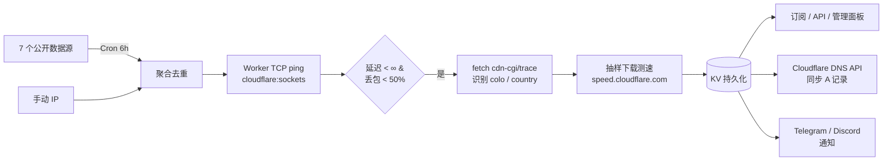

# cf-best-ip · Cloudflare 优选 IP 集大成版

[](LICENSE)
[](https://workers.cloudflare.com/)
[](src/worker.js)

一个跑在 **Cloudflare Workers** 上的优选 IP 一站式服务。
把社区里几款主流方案的优点全部收下，再加四个独家功能。

> 详细对比：[`docs/analysis.md`](docs/analysis.md)

---

## ✨ 功能总览

### 别人有的，全都有
| 能力 | 来源 |
|---|---|
| 多源聚合（7 个公开数据源，单源失败自动跳过） | cfnb / CF Workers 重制版 |
| 真实 TCP 三次握手测速（基于 `cloudflare:sockets`） | CFST |
| HTTP 带宽抽样测速 + colo / 国家自动识别 | CFST 思路 |
| Cron 定时刷新（默认 6 小时） | cfnb |
| Cloudflare DNS A 记录自动同步 | cfnb |
| 多协议订阅：纯文本、JSON、EdgeTunnel、V2Ray base64、Clash YAML | cmliu 系列 |
| 管理面板 + 密码保护 + 订阅 token | CF Workers 重制版 |
| 浏览器在线测速 | itdog 风格 |
| KV 持久化 + 历史快照（30 天 TTL） | — |

### 别人没有的，本项目独家 ★
1. **多维度筛选 API** —— 一个接口，`country` / `colo` / `carrier` / `port` / `maxDelay` / `minMbps` / `exclude` / `top` 全部可叠加
2. **分运营商 DNS 同步** —— `CF_DNS_BY_CARRIER=1` 启用后自动生成：
   - `cf.example.com` —— 全局 Top N
   - `ct.example.com` —— 电信 Top N
   - `cu.example.com` —— 联通 Top N
   - `cm.example.com` —— 移动 Top N
3. **智能就近订阅** —— `/sub?smart=1` 用 `request.cf.colo` 自动判断访问者所在区域，把同区国家节点排到最前
4. **CIDR 自定义扫描** —— 管理面板贴一段 CIDR（≤ /26），Worker 边缘直接开扫，60 秒内出结果

### 通知 & 自动化
- Cron 完成后通过 **Telegram Bot** 或 **Discord Webhook** 推送 Top 5 节点
- 失败统计直接体现在 `/api/stats`，包括各源贡献数和报错

---

## 🚀 3 分钟部署

### 方法 A：Wrangler CLI（推荐）

```bash
git clone https://github.com/LeilaoMi/cf-best-ip.git
cd cf-best-ip
npm i -g wrangler
wrangler login

# 1) 创建 KV，把返回的 id 填到 wrangler.toml
npx wrangler kv namespace create KV

# 2) 注入密码
wrangler secret put ADMIN_PASSWORD

# 3) 部署
wrangler deploy
```

部署完会得到 `https://cf-best-ip.<your>.workers.dev`，直接访问就是首页。

### 方法 B：网页一把梭（无 CLI）

1. Cloudflare 后台 → **Workers & Pages** → **Create application** → **Create Worker** → 命名后保存。
2. **Bindings** → 新建 **KV namespace** 绑定，变量名固定 `KV`。
3. **Settings → Variables** 添加：
   - `ADMIN_PASSWORD` （勾选 Encrypt）
   - 其他按需添加（见下面"可选"）
4. **Settings → Triggers → Cron Triggers** 添加 `0 */6 * * *`。
5. **Compatibility Flags** 加上 `nodejs_compat`（启用 TCP socket）。
6. 复制 `src/worker.js` 全部代码 → 粘进 Worker 编辑器 → **Deploy**。

---

## ⚙️ 环境变量

### 必填
| 变量 | 说明 |
|---|---|
| `ADMIN_PASSWORD` | 管理员密码（Basic Auth） |

### 可选 — 启用自动 DNS 同步
| 变量 | 说明 |
|---|---|
| `CF_API_TOKEN` | API Token，权限 `Zone:DNS:Edit` |
| `CF_ZONE_ID` | 域名所在 Zone ID |
| `CF_RECORD_NAME` | 主 A 记录，例如 `cf.example.com` |
| `CF_DNS_BY_CARRIER` | 设为 `1` 启用分运营商同步（`ct.` / `cu.` / `cm.` 前缀） |
| `DNS_TOP_N` | DNS 同步取前 N 个，默认 `10` |

### 可选 — 订阅鉴权
| 变量 | 说明 |
|---|---|
| `SUB_TOKEN` | 设置后，所有订阅 URL 必须带 `?token=xxx` 或 `Authorization: Bearer xxx` |

### 可选 — 通知
| 变量 | 说明 |
|---|---|
| `TELEGRAM_BOT_TOKEN` + `TELEGRAM_CHAT_ID` | Cron 完成后 Telegram 推送 Top 5 |
| `DISCORD_WEBHOOK` | Discord 通知 |

---

## 📡 接口一览（全部支持地区/运营商筛选）

| 路径 | 用途 |
|---|---|
| `/` | 首页 · 当前节点状态 + Top 15 |
| `/test` | 在线测速页 |
| `/admin` | 管理面板（密码保护） |
| `/sub` | 纯文本订阅 |
| `/api/ips` | JSON 详细列表 |
| `/api/preferred-ips` | EdgeTunnel 兼容（纯 ip:port） |
| `/api/v2ray` | V2Ray base64 订阅 |
| `/api/clash` | Clash YAML |
| `/api/stats` | 节点维度统计（按国家/colo/运营商分布） |
| `/api/history?days=7` | 最近 N 天每日 Top1 节点 |
| `/api/probe?ip=...&port=443` | 单 IP 实时测速 |
| `/api/refresh` | 手动触发全量测速（需 Basic Auth） |
| `/api/dns/sync` | 手动触发 DNS 同步（需 Basic Auth） |
| `/api/cidr-scan` | CIDR 扫描（需 Basic Auth） |
| `/api/manual` | 手动 IP 增删查（需 Basic Auth） |
| `/api/config` | 读写配置 |

### 筛选参数（任意叠加）
| 参数 | 示例 | 说明 |
|---|---|---|
| `country` | `country=US,JP,HK` | 按国家代码筛选 |
| `colo` | `colo=HKG,NRT` | 按 Cloudflare 机场代码筛选 |
| `carrier` | `carrier=CT` | 运营商：`CT` 电信 / `CU` 联通 / `CM` 移动 / `CF` 通用 |
| `port` | `port=443,2053` | 端口 |
| `maxDelay` | `maxDelay=80` | 最大延迟（ms） |
| `minMbps` | `minMbps=20` | 最低带宽（Mbps） |
| `exclude` | `exclude=CN,RU` | 排除国家 |
| `top` | `top=20` | 取前 N，默认 20，最大 200 |
| `smart` | `smart=1` | 智能就近：按访问者 colo 自动优先同区域 |
| `token` | `token=xxx` | 订阅鉴权（设置了 `SUB_TOKEN` 才需要） |

### 实用例子

```bash
# 只要美国 + 日本 + 不超过 80ms 的前 10 个
curl 'https://your.workers.dev/sub?country=US,JP&maxDelay=80&top=10'

# 中国电信用户专用订阅
curl 'https://your.workers.dev/sub?carrier=CT&top=20'

# 香港机场节点的 Clash 配置
curl 'https://your.workers.dev/api/clash?colo=HKG'

# 智能就近（同 colo 国家优先）
curl 'https://your.workers.dev/sub?smart=1&top=30'

# 手动触发测速
curl -u admin:PASSWORD 'https://your.workers.dev/api/refresh'

# CIDR 扫描
curl -u admin:PASSWORD -X POST 'https://your.workers.dev/api/cidr-scan' \
  -H 'content-type: application/json' \
  -d '{"cidr":"173.245.48.0/26","port":443}'
```

---

## 🧠 工作原理



**关键技术点**：
- TCP ping 用 Workers 原生 `cloudflare:sockets.connect()`，比 HTTP-based 探测精确得多
- colo / 国家识别走 `fetch('https://cloudflare.com/cdn-cgi/trace', { cf: { resolveOverride: ip } })`，证书有效不会失败
- 带宽测速直接打 `speed.cloudflare.com/__down`，由 Worker 在边缘代为下载

> **⚠️ 免费版 / 付费版差异**
>
> | 功能 | Free | Paid ($5/月) |
> |---|---|---|
> | 多源聚合 / 订阅 / API / 管理面板 / DNS 同步 / Webhook | ✅ | ✅ |
> | TCP 三次握手测速（`cloudflare:sockets`） | ✅ | ✅ |
> | CIDR 自定义扫描 | ✅ | ✅ |
> | 智能就近 `/sub?smart=1` | ✅ | ✅ |
> | colo / 国家识别 (`cf.resolveOverride`) | ⚠️ 字段为空 | ✅ |
> | 带宽测速 `mbps` 字段 | ⚠️ 字段为空 | ✅ |
>
> 注：`cf.resolveOverride` 仅 Enterprise / Paid 用户能跨 zone 生效。免费版上 TCP ping + carrier 标签已足够把节点排好序，colo/mbps 仅作展示锦上添花，不影响核心优选。

---

## 📂 项目结构

```
cf-best-ip/
├── README.md                  本文档
├── LICENSE                    MIT
├── src/worker.js              ★ 单文件 Worker（870 行，无依赖）
├── wrangler.toml              部署配置
├── zo-space/                  另一个版本：跑在 zo.space 上（Hono + React）
│   ├── pages/cf-ip.tsx
│   └── api/{get,refresh,probe}.ts
└── docs/
    ├── analysis.md            6 类主流项目对照表
    └── screenshot.png
```

---

## 🤝 致谢

- [XIU2/CloudflareSpeedTest](https://github.com/XIU2/CloudflareSpeedTest) —— 测速算法的祖师爷
- [xinyitang3/cfnb](https://github.com/xinyitang3/cfnb) —— 自动化思路
- [cmliu/edgetunnel](https://github.com/cmliu/edgetunnel) —— 订阅接口约定
- 各位维护公开 IP 源的朋友：090227.xyz / 164746.xyz / IPDB / hostmonit 等

## 📄 License

MIT © 2026 truepuma
